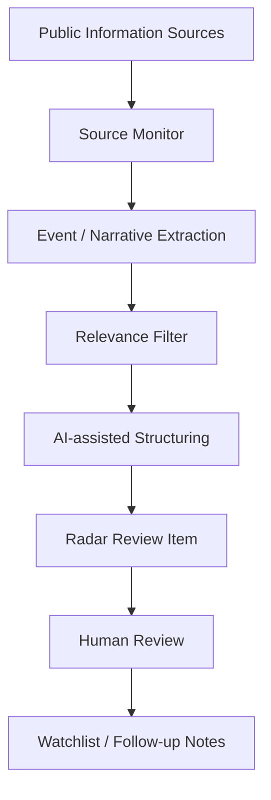
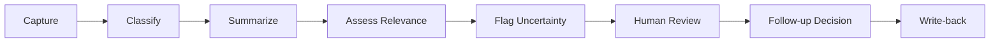

# Crypto Radar

## Portfolio Note

This repository is a public-safe portfolio case prepared by QIAN Boyu (Bowie) for graduate applications in AI, enterprise AI systems, and the SUTD MSc in Design and Artificial Intelligence for Enterprise.

Crypto Radar is documented as an AI-assisted market intelligence workflow and human-in-the-loop decision-support concept. It is not presented as a trading signal bot, automated trading system, or financial advice product.

## Project Summary

Crypto Radar is an AI-assisted crypto market intelligence radar that monitors news, events, policy shifts, market narratives, and potential market-moving information changes.

The project explores how unstructured public information can be captured, structured, prioritized, and reviewed before any human follow-up decision. Its focus is information-to-decision workflow design under uncertainty, not automated trade execution.

## Problem Context

Crypto markets are highly information-sensitive. Important changes may appear in news, policy, regulation, project announcements, social narratives, exchange listings, macro events, or sentiment shifts before they appear clearly on price charts.

Traders and analysts face information overload. Raw information is noisy, incomplete, and easy to misinterpret. The challenge is turning unstructured information into structured review items that support human judgment without overstating confidence.

## My Role

Founder / Product Designer / AI Workflow Designer

Responsibilities:

- Problem framing
- Information workflow design
- Radar logic
- Information-to-decision pipeline design
- Review item structure
- Public-safe documentation

## Current Implementation Status

Completed:

- Problem framing
- Market intelligence workflow concept
- Public-safe architecture
- Information-to-decision pipeline
- Human-in-the-loop review logic
- Portfolio-safe documentation

In Progress:

- Source monitoring design
- Event classification framework
- Review item prioritization
- Alert template design
- Public-safe demo examples

Not Included Publicly:

- API keys/tokens
- Private data feeds
- Paid sources
- Trading account data
- Real trading signals
- Proprietary strategy rules
- Portfolio holdings
- Private Telegram configuration
- Production deployment details

## Repository Structure

```text
crypto-radar/
|-- README.md
|-- docs/
|   |-- project-overview.md
|   |-- system-architecture.md
|   |-- workflow.md
|   |-- information-to-decision-pipeline.md
|   |-- data-governance.md
|   |-- evaluation-rubric.md
|   |-- sample-radar-item.md
|   |-- product-roadmap.md
|   `-- sutd-fit.md
`-- assets/
    `-- README.md
```

- `docs/project-overview.md`: problem, target users, AI value, human review, role, and portfolio boundary.
- `docs/system-architecture.md`: high-level system layers and limitations.
- `docs/workflow.md`: operating workflow from capture to write-back.
- `docs/information-to-decision-pipeline.md`: how unstructured information becomes a structured review item.
- `docs/data-governance.md`: public/private source rules and safety boundaries.
- `docs/evaluation-rubric.md`: criteria for evaluating radar review items.
- `docs/sample-radar-item.md`: fictional synthetic radar item for demonstration.
- `docs/product-roadmap.md`: staged development path.
- `docs/sutd-fit.md`: connection to SUTD DAI-E.
- `assets/README.md`: rules for future public-safe visual assets.

## System Overview



## Information-to-Decision Workflow



## Responsible AI and Safety Boundaries

This repository is not financial advice and does not provide trading signals. Crypto Radar is not an automated trading system.

AI outputs require human review. Source provenance, uncertainty disclosure, and public/private source boundaries are necessary because market information can be incomplete, misleading, or rapidly outdated.

This public-safe repository excludes real signals, account data, private data feeds, paid sources, proprietary strategy logic, private prompts, private Telegram configuration, production deployment details, API keys, tokens, and credentials.

## Relevance to SUTD MSc DAI-E

Crypto Radar connects to the SUTD MSc in Design and Artificial Intelligence for Enterprise through:

- Design-led problem framing
- AI-assisted information structuring
- Human-AI collaboration
- Workflow architecture
- Decision support under uncertainty
- Responsible AI boundaries
- Enterprise-style intelligence workflows

The project reflects my interest in designing AI systems that help humans structure noisy information, preserve uncertainty, and make better-reviewed decisions in fast-moving environments.

## Next Steps

- Define public source categories
- Create event classification taxonomy
- Build synthetic radar item examples
- Design alert templates
- Add source provenance tracking
- Prepare public-safe screenshots after all four repositories are complete
