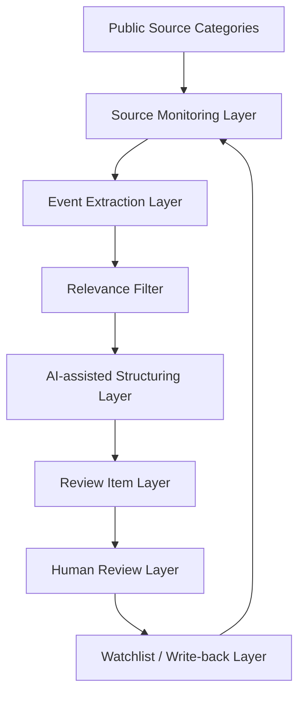

# System Architecture

## High-Level Architecture

Crypto Radar is designed as an AI-assisted information workflow for monitoring public market-relevant information and converting it into structured human review items.

## Source Monitoring Layer

The source monitoring layer tracks defined public source categories such as news, policy updates, public regulatory materials, official project announcements, exchange policy updates, macro events, and public market narratives.

This public repository does not include private sources, paid feeds, private Telegram configuration, credentials, or production monitoring details.

## Event Extraction Layer

The event extraction layer identifies possible information changes from raw text or source summaries.

Examples of event categories:

- Regulatory consultation
- Exchange policy update
- Project ecosystem announcement
- Macro policy event
- Security or risk disclosure
- Public narrative shift

## Relevance Filter

The relevance filter determines whether an event deserves structured review. It considers source type, event category, market context, uncertainty, and possible follow-up value.

The filter is not a trading rule. It is a prioritization aid for human review.

## AI-Assisted Structuring Layer

AI assists by converting unstructured information into a consistent review item format.

Possible fields include:

- Raw information summary
- Source type
- Event category
- Relevance hypothesis
- Market context
- Uncertainty and missing information
- Suggested human review questions
- Follow-up state

## Review Item Layer

The review item layer stores structured radar items. These items are designed to be reviewed, compared, and written back after human judgment.

## Human Review Layer

The human review layer checks source credibility, uncertainty, relevance, and next steps.

Human review prevents AI-generated summaries from becoming unverified trading assumptions.

## Watchlist / Write-back Layer

Reviewed items may be written back as follow-up notes, watchlist entries, monitoring tasks, or dismissed items.

The write-back layer preserves the reasoning process without creating automated trading actions.

## Limitations

Current limitations:

- Public documentation only
- Synthetic examples only
- No private data sources
- No real trading signals
- No automated execution
- No profitability claim
- No production deployment details
