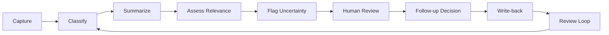

# Workflow

## 1. Capture

Capture public information from defined source categories such as news, policy updates, public regulatory materials, exchange policy announcements, project ecosystem updates, macro events, or public market narratives.

## 2. Classify

Classify the captured item by event type. Classification helps separate regulatory, technical, project, exchange, macro, and narrative events.

## 3. Summarize

Summarize the raw information into a short, source-aware description.

The summary should avoid hype and should not turn uncertain information into a trading conclusion.

## 4. Assess Relevance

Assess why the information may matter. This step creates a relevance hypothesis, not a signal.

The assessment should identify possible affected themes, uncertainty, and follow-up needs.

## 5. Flag Uncertainty

Flag missing information, unclear source quality, conflicting narratives, timing ambiguity, or unknown implementation details.

Uncertainty is a first-class part of the review item.

## 6. Human Review

A human reviewer checks whether the structured item is accurate, relevant, and worth follow-up.

The reviewer may accept, revise, deprioritize, or reject the item.

## 7. Follow-up Decision

The follow-up decision may be:

- Monitor for updates
- Add to research queue
- Compare with related events
- Dismiss as low relevance
- Wait for confirmation from primary sources

This is not an automated trading decision.

## 8. Write-back

Write back the review state, rationale, and next step. This makes the workflow auditable and reusable.

## 9. Review Loop

Radar items should be reviewed regularly to update stale assumptions, close outdated items, and refine classification rules.

